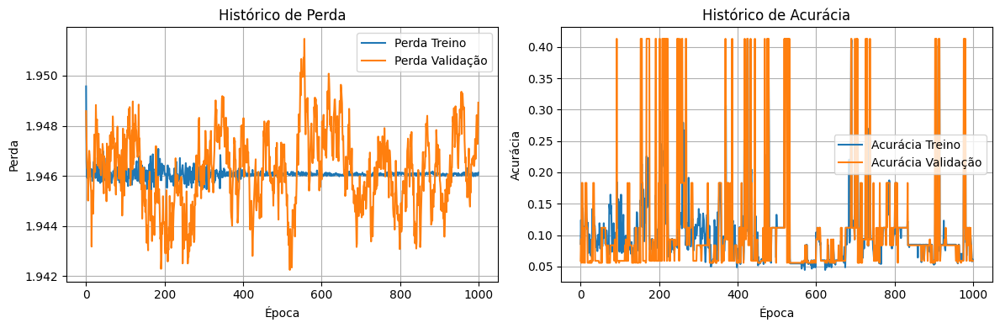
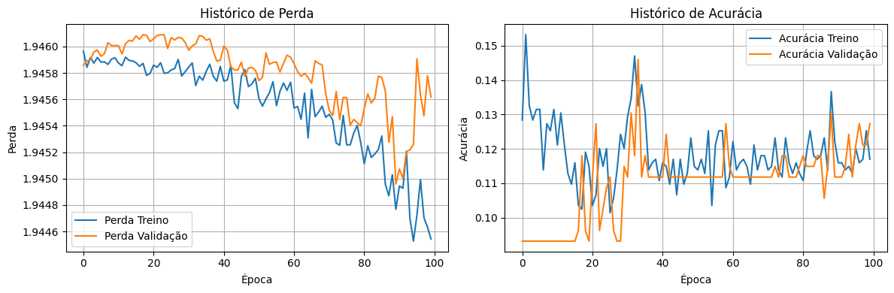

Segue abaixo a versão em inglês do README, estruturada de forma bilíngue:

---

## Português

# Classificador de Faces com Keras (API Sequencial) - Dataset Olivetti

Este projeto implementa um classificador de faces utilizando a API Sequencial do Keras, com base nos ensinamentos do Capítulo 10 e seguintes do livro "Hands-On Machine Learning with Scikit-Learn, Keras & TensorFlow" (2ª Edição). O objetivo inicial era construir um modelo do zero, mas a jornada revelou a importância crucial da escolha e adequação do dataset. O modelo final utiliza o dataset Olivetti Faces e alcança alta acurácia.

## A Jornada: Desafios e Aprendizados

Minha intenção era aplicar diretamente os conceitos do livro para construir uma Rede Neural Convolucional (CNN) capaz de classificar faces.

### Tentativa 1: Dataset Labeled Faces in the Wild (LFW)

Comecei utilizando um subconjunto do LFW, filtrando por pessoas com pelo menos 70 imagens (`Workspace_lfw_people(min_faces_per_person=70)`). Rapidamente enfrentei problemas:

1. **Baixa Acurácia:** Os resultados iniciais foram ruins (acurácia em torno de 41%).
2. **Previsão Enviesada:** O modelo tendia a prever sempre a mesma classe (Classe 3 - George W Bush).
3. **Desbalanceamento de Classes:** Uma análise revelou um forte desbalanceamento, com a classe 3 tendo muito mais amostras que as outras:
   - Classe 0 (Ariel Sharon): 58 amostras (Treino) / 19 (Teste)
   - Classe 1 (Colin Powell): 177 / 59
   - Classe 2 (Donald Rumsfeld): 91 / 30
   - **Classe 3 (George W Bush): 397 / 133**
   - Classe 4 (Gerhard Schroeder): 82 / 27
   - Classe 5 (Hugo Chavez): 53 / 18
   - Classe 6 (Tony Blair): 108 / 36

### Tentativa 2: Corrigindo o Desbalanceamento e Ajustando (LFW)

Para combater o desbalanceamento, apliquei pesos às classes (`class_weight='balanced'`). Aumentei também o número de épocas para 1000, esperando que o modelo tivesse mais tempo para aprender. Os resultados foram surpreendentemente piores:

- A acurácia caiu para ~5.9%.
- O modelo passou a prever sempre a Classe 0 (uma das minoritárias).
- As **curvas de aprendizado ficaram completamente planas**, indicando que o modelo não estava aprendendo absolutamente nada, mesmo com muitas épocas:
  
  

  Tentei ajustar a taxa de aprendizado exaustivamente, desde valores muito baixos (`1e-5`) até os padrões, mas as curvas permaneciam planas:

  

### Tentativa 3: Mudança de Estratégia - Dataset Olivetti

Concluí que a natureza "selvagem" (não padronizada) do LFW, com suas grandes variações de pose, iluminação e o desbalanceamento, tornava a tarefa excessivamente difícil para uma CNN treinada do zero com dados limitados, no contexto deste exercício focado nos fundamentos do livro.

Decidi mudar para um dataset mais controlado: **ORL Database of Faces (Olivetti)**, disponível via `sklearn.datasets.fetch_olivetti_faces`. Este dataset possui características muito mais favoráveis:

- 40 classes (pessoas).
- 10 imagens por classe (perfeitamente balanceado).
- Imagens em escala de cinza (64x64 pixels).
- Poses majoritariamente frontais e iluminação mais controlada.
- Valores de pixel já normalizados entre 0 e 1.

Com o dataset Olivetti, **removi a necessidade de `class_weight`** e comecei a ajustar novamente a taxa de aprendizado. Experimentando entre `1e-5` e `0.001`, descobri que `0.001` (o padrão do Adam) funcionou muito bem para este dataset.

## Resultados Finais (Dataset Olivetti)

Com o dataset Olivetti e a taxa de aprendizado de 0.001, o modelo treinou com sucesso:

- **Acurácia no Teste: 95.00%**
- **Perda no Teste: 0.1014**

As curvas de treinamento demonstram um aprendizado eficiente e boa generalização:

- A perda diminui consistentemente e a acurácia aumenta rapidamente.
- As curvas de treino e validação estão próximas, indicando baixo overfitting.

## O Código

O notebook Jupyter (`face_classifier_olivetti.ipynb`) contém toda a implementação, desde o carregamento dos dados Olivetti, pré-processamento, construção do modelo CNN com a API Sequencial do Keras, treinamento e avaliação.

## Dataset Utilizado

O modelo final e bem-sucedido utiliza o **Olivetti Faces dataset**, carregado via `sklearn.datasets.fetch_olivetti_faces`.

## Dependências

As principais bibliotecas utilizadas são:

- TensorFlow (Keras)
- Scikit-learn
- NumPy
- Matplotlib

## Como Executar

1. Clone este repositório: `git clone https://github.com/charlierf/hands-on-ml-face-recognition.git`
2. Navegue até a pasta: `cd hands-on-ml-face-recognition`
3. Instale as dependências usando o comando `pip install -r requirements.txt`.
4. Abra o notebook `face_classifier_olivetti.ipynb` em um ambiente Jupyter (como Jupyter Lab, Jupyter Notebook ou Google Colab) e execute as células.

## Aprendizados Chave

- **A adequação do dataset é crucial:** Um dataset mais limpo, balanceado e padronizado pode facilitar enormemente o treinamento de modelos do zero. A dificuldade inicial estava mais no desafio imposto pelo LFW do que em erros fundamentais na abordagem inicial da CNN.
- **Análise de Curvas é Fundamental:** Curvas de aprendizado planas são um sinal claro de problemas (taxa de aprendizado, arquitetura inadequada, etc.) que precisam ser investigados.
- **Debugging Sistemático:** Testar hipóteses (desbalanceamento, taxa de aprendizado) de forma isolada ajuda a entender o problema.
- **Persistência e Iteração:** O processo de Machine Learning envolve experimentar, analisar resultados (bons ou ruins) e ajustar a abordagem.

---

Espero que este repositório e o relato da minha experiência sejam úteis!

---

## English

# Face Classifier with Keras (Sequential API) - Olivetti Dataset

This project implements a face classifier using Keras' Sequential API, based on the teachings from Chapter 10 and following of the book "Hands-On Machine Learning with Scikit-Learn, Keras & TensorFlow" (2nd Edition). The initial goal was to build a model from scratch, but the journey revealed the crucial importance of selecting and adapting the dataset. The final model uses the Olivetti Faces dataset and achieves high accuracy.

## The Journey: Challenges and Learnings

My intention was to directly apply the book’s concepts to build a Convolutional Neural Network (CNN) capable of classifying faces.

### Attempt 1: Labeled Faces in the Wild (LFW) Dataset

I started by using a subset of LFW, filtering for people with at least 70 images (`Workspace_lfw_people(min_faces_per_person=70)`). I quickly encountered issues:

1. **Low Accuracy:** The initial results were poor (accuracy around 41%).
2. **Biased Predictions:** The model tended to predict the same class (Class 3 - George W Bush).
3. **Class Imbalance:** Analysis revealed a strong imbalance, with Class 3 having many more samples than the others:
   - Class 0 (Ariel Sharon): 58 samples (Train) / 19 (Test)
   - Class 1 (Colin Powell): 177 / 59
   - Class 2 (Donald Rumsfeld): 91 / 30
   - **Class 3 (George W Bush): 397 / 133**
   - Class 4 (Gerhard Schroeder): 82 / 27
   - Class 5 (Hugo Chavez): 53 / 18
   - Class 6 (Tony Blair): 108 / 36

### Attempt 2: Correcting Imbalance and Adjustments (LFW)

To address the imbalance, I applied class weights (`class_weight='balanced'`). I also increased the number of epochs to 1000, hoping the model would have more time to learn. The results turned out to be surprisingly worse:

- Accuracy dropped to ~5.9%.
- The model began to predict only Class 0 (one of the minority classes).
- The **learning curves were completely flat**, indicating that the model was not learning anything, even with many epochs:
  
  

  I tried adjusting the learning rate extensively, from very low values (`1e-5`) to the default, but the curves remained flat:

  

### Attempt 3: Changing Strategy – Olivetti Dataset

I concluded that the “wild” (non-standardized) nature of LFW, with its large variations in pose, lighting, and imbalance, made the task excessively difficult for a CNN trained from scratch with limited data, especially in the context of this exercise focused on the fundamentals of the book.

I decided to switch to a more controlled dataset: the **ORL Database of Faces (Olivetti)**, available via `sklearn.datasets.fetch_olivetti_faces`. This dataset has much more favorable characteristics:

- 40 classes (people).
- 10 images per class (perfectly balanced).
- Grayscale images (64x64 pixels).
- Mostly frontal poses with more controlled lighting.
- Pixel values already normalized between 0 and 1.

With the Olivetti dataset, I **removed the need for `class_weight`** and began adjusting the learning rate again. Experimenting between `1e-5` and `0.001`, I found that `0.001` (the default for Adam) worked very well for this dataset.

## Final Results (Olivetti Dataset)

Using the Olivetti dataset and a learning rate of 0.001, the model trained successfully:

- **Test Accuracy: 95.00%**
- **Test Loss: 0.1014**

The training curves demonstrate efficient learning and good generalization:

- The loss decreases consistently and accuracy increases rapidly.
- The training and validation curves are close, indicating low overfitting.

## The Code

The Jupyter Notebook (`face_classifier_olivetti.ipynb`) contains the complete implementation, from loading the Olivetti data, preprocessing, building the CNN with Keras' Sequential API, to training and evaluation.

## Dataset Used

The final, successful model uses the **Olivetti Faces dataset**, loaded via `sklearn.datasets.fetch_olivetti_faces`.

## Dependencies

The main libraries used are:

- TensorFlow (Keras)
- Scikit-learn
- NumPy
- Matplotlib

## How to Run

1. Clone this repository: `git clone https://github.com/charlierf/hands-on-ml-face-recognition.git`
2. Navigate to the project folder: `cd hands-on-ml-face-recognition`
3. Install the dependencies using: `pip install -r requirements.txt`
4. Open the notebook `face_classifier_olivetti.ipynb` in a Jupyter environment (e.g., Jupyter Lab, Jupyter Notebook, or Google Colab) and run the cells.

## Key Learnings

- **The Importance of Dataset Suitability:**  
  A cleaner, balanced, and standardized dataset can greatly facilitate training a model from scratch. The initial difficulties were more due to the challenges posed by LFW than any fundamental issues with the CNN approach.
- **Analyzing Learning Curves is Crucial:**  
  Flat learning curves clearly signal issues (learning rate, inadequate architecture, etc.) that need investigation.
- **Systematic Debugging:**  
  Testing hypotheses (class imbalance, learning rate) in isolation helps understand the problem.
- **Persistence and Iteration:**  
  The Machine Learning process involves experimenting, analyzing both good and bad results, and adjusting the approach accordingly.

---

I hope this repository and the story of my experience are helpful!
