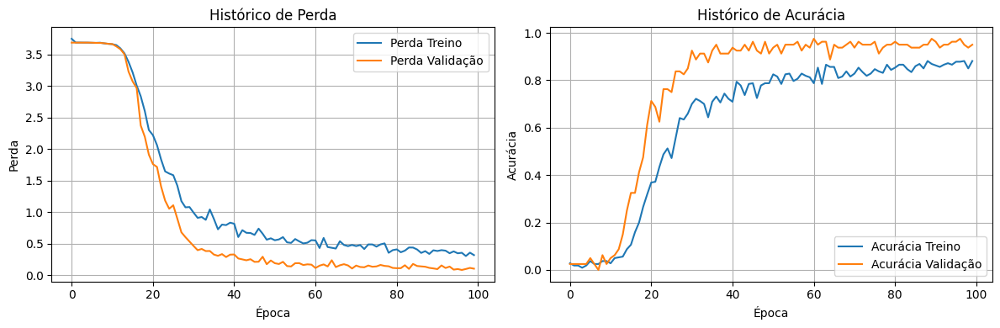
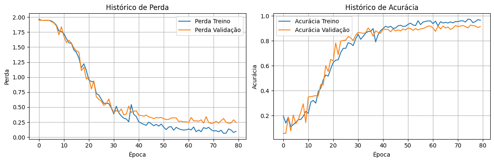

## Português

# Classificador de Faces com Keras: Uma Jornada com LFW e Olivetti

Este projeto documenta a implementação de um classificador de faces utilizando a API Sequencial do Keras, inspirado no Capítulo 10 do livro "Hands-On Machine Learning with Scikit-Learn, Keras & TensorFlow" (2ª Edição). A jornada foi marcada por desafios iniciais com o dataset Labeled Faces in the Wild (LFW), um teste de diagnóstico bem-sucedido com o dataset Olivetti, e a descoberta de um erro crucial de pré-processamento que permitiu o sucesso final com o LFW.

## Fase 1: O Desafio Inicial com LFW

O objetivo era treinar uma Rede Neural Convolucional (CNN) do zero no dataset LFW, utilizando o subconjunto `lfw_people(min_faces_per_person=70)`.

### O Erro de Pré-processamento

Parti da **suposição incorreta** de que os pixels das imagens LFW estavam no intervalo 0-255. Com base nisso, apliquei uma normalização manual, dividindo todos os valores por 255.0 (`X / 255.0`).

### Falha no Treinamento

As primeiras tentativas de treinamento falharam completamente:
* A acurácia era extremamente baixa (~5-10%).
* O modelo não aprendia, com as **curvas de perda e acurácia permanecendo planas** ao longo das épocas.
* Tentativas de usar `class_weight` (para o desbalanceamento do LFW) ou ajustar a taxa de aprendizado não surtiram efeito, pois o problema fundamental não era esse.

## Fase 2: Diagnóstico - Testando a Hipótese com Olivetti

Diante da falha com o LFW, surgiu a dúvida: o problema era a complexidade do LFW (variações de pose, iluminação, desbalanceamento) ou a arquitetura da minha CNN estava fundamentalmente inadequada?

Para isolar o problema, decidi realizar um **teste controlado** usando um dataset mais simples e padronizado: o **ORL Database of Faces (Olivetti)**, obtido via `olivetti_faces`. Este dataset é balanceado, possui menos variações e, importante, eu sabia que já vinha com pixels normalizados [0, 1].

### Sucesso com Olivetti

O treinamento no Olivetti foi bem-sucedido rapidamente:
* **Acurácia no Teste: 95.00%** (com `learning_rate=0.001`)
* As curvas de aprendizado mostraram clara convergência e boa generalização:

**Conclusão da Fase 2:** O sucesso no Olivetti foi um forte indicativo de que a arquitetura da CNN era capaz de aprender. Isso direcionou a investigação de volta para como o dataset LFW estava sendo tratado.

## Fase 3: A Descoberta e o Sucesso Final com LFW

Revisitei os dados retornados por `lfw_people` e fiz a **descoberta crucial**: a função do Scikit-learn **já normaliza os pixels do LFW para o intervalo [0, 1]!**

Meu passo de dividir por 255 era redundante e prejudicial, "espremendo" os dados e impedindo o aprendizado.

### Correção e Novo Treinamento

Removi a linha `X / 255.0` do pré-processamento e treinei novamente o modelo **no LFW**, aplicando as lições:
* Usei os dados LFW **corretamente pré-processados** (normalização [0, 1] original).
* Mantive o `class_weight='balanced'` (pois o LFW *é* desbalanceado).
* Utilizei a taxa de aprendizado padrão do Adam (0.001), que agora funcionou bem.

## Resultados Finais (Dataset LFW Corrigido)

Com o pré-processamento correto, o modelo finalmente aprendeu com sucesso no dataset LFW:

* **Acurácia no Teste (LFW): 88.76%**
* **Perda no Teste (LFW): 0.3214**

As curvas de treinamento mostram o aprendizado efetivo, embora com algum overfitting começando a surgir no final (esperado para LFW):

## O Código

O notebook Jupyter (`face_classifier_keras.ipynb`) contém toda a implementação, desde o carregamento dos dados do LFW e do Olivetti, pré-processamento, construção do modelo CNN com a API Sequential do Keras, treinamento e avaliação.

## Datasets Utilizados

* **LFW (Principal):** Subset do Labeled Faces in the Wild via `sklearn.datasets.fetch_lfw_people(min_faces_per_person=70)`. Contém 7 classes (nesta configuração), é desbalanceado e **já vem com pixels normalizados [0, 1]**.
* **Olivetti (Diagnóstico):** ORL Database of Faces via `sklearn.datasets.fetch_olivetti_faces`. Contém 40 classes, 10 imagens/classe (balanceado), 64x64 grayscale, **já vem com pixels normalizados [0, 1]**.

## Dependências

As principais bibliotecas utilizadas são:

- TensorFlow (Keras)
- Scikit-learn
- NumPy
- Matplotlib

## Como Executar

1. Clone este repositório: `git clone https://github.com/charlierf/hands-on-ml-face-recognition.git`
2. Navegue até a pasta: `cd hands-on-ml-face-recognition`
3. Instale as dependências usando o comando `pip install -r requirements.txt`.
4. Abra o notebook `face_classifier_keras.ipynb` em um ambiente Jupyter (como Jupyter Lab, Jupyter Notebook ou Google Colab) e execute as células.

## Aprendizados Chave

* **A LIÇÃO MAIS IMPORTANTE: ENTENDA SEUS DADOS!** Verificar o range, o formato e o pré-processamento já aplicado é absolutamente crítico. Uma suposição errada aqui pode invalidar todo o esforço.
* **Pré-processamento Correto é Vital:** A normalização adequada foi a diferença entre falha total e sucesso.
* **Testes Controlados para Diagnóstico:** Usar um dataset mais simples (Olivetti) foi essencial para isolar o problema e confirmar a viabilidade da arquitetura do modelo.
* **Análise de Curvas:** Fundamental para entender se o modelo está aprendendo, estagnado ou sofrendo overfitting.
* **Tratamento de Desbalanceamento:** Necessário para datasets como o LFW (`class_weight`).

---

Espero que este repositório e o relato da minha experiência sejam úteis!

---

## English

# Face Classifier with Keras: A Journey with LFW and Olivetti

This project documents the implementation of a face classifier using the Keras Sequential API, inspired by Chapter 10 of the book "Hands-On Machine Learning with Scikit-Learn, Keras & TensorFlow" (2nd Edition). The journey involved initial challenges with the Labeled Faces in the Wild (LFW) dataset, a successful diagnostic test using the Olivetti dataset, and the discovery of a critical preprocessing error that led to final success with LFW.

## Phase 1: The Initial Challenge with LFW

The goal was to train a Convolutional Neural Network (CNN) from scratch on the LFW dataset, using the `lfw_people(min_faces_per_person=70)` subset.

### The Preprocessing Error

I started under the **incorrect assumption** that the LFW pixel values were in the 0-255 range. Based on this, I applied a manual normalization step, dividing all values by 255.0 (`X / 255.0`).

### Training Failure

The initial training attempts failed completely:
* Accuracy was extremely low (~5-10%).
* The model failed to learn; the **loss and accuracy curves remained flat** throughout training.
* Attempts to use `class_weight` (for LFW's known imbalance) or extensive learning rate tuning had no effect, as the fundamental problem lay elsewhere.

## Phase 2: Diagnosis - Testing Hypotheses with Olivetti

Faced with the LFW failure, the question arose: Was the issue the inherent complexity of LFW (pose/lighting variations, imbalance) or was my CNN architecture fundamentally flawed?

To isolate the problem, I decided to run a **controlled experiment** using a simpler, standardized dataset: the **ORL Database of Faces (Olivetti)**, obtained via `olivetti_faces`. This dataset is balanced, has less variance, and importantly, I knew it came with correctly normalized [0, 1] pixel values.

### Success with Olivetti

Training on the Olivetti dataset was quickly successful:
* **Test Accuracy: 95.00%** (with `learning_rate=0.001`)
* The learning curves showed clear convergence and good generalization:

**Conclusion from Phase 2:** The success on Olivetti strongly suggested that the CNN architecture was capable of learning. This refocused the investigation back to how the LFW dataset was being handled.

## Phase 3: The Breakthrough and Final Success with LFW

I revisited the documentation and the data returned by `lfw_people` and made the **crucial discovery**: the Scikit-learn function **already normalizes LFW pixels to the [0, 1] range!**

My step of dividing by 255 was redundant and detrimental, squashing the data and preventing the network from learning.

### Correction and Retraining

I removed the `X / 255.0` line from the preprocessing and retrained the model **on LFW**, applying the lessons learned:
* Used the **correctly preprocessed** LFW data (original [0, 1] normalization).
* Kept `class_weight='balanced'` (as LFW *is* imbalanced).
* Used the default Adam optimizer learning rate (0.001), which now worked well.

## Final Results (Corrected LFW Dataset)

With the correct preprocessing, the model finally learned successfully on the LFW dataset:

* **LFW Test Accuracy: 88.76%**
* **LFW Test Loss: 0.3214**

The training curves show effective learning, although with some expected overfitting starting towards the end:

## The Code

The Jupyter Notebook (`face_classifier_keras.ipynb`) contains the complete implementation, from loading the LFW and Olivetti data, preprocessing, building the CNN with Keras' Sequential API, to training and evaluation.

## Datasets Used

* **LFW (Main):** Subset of Labeled Faces in the Wild via `sklearn.datasets.fetch_lfw_people(min_faces_per_person=70)`. Contains 7 classes (in this configuration), is imbalanced, and **already has pixels normalized to [0, 1] by sklearn**.
* **Olivetti (Diagnostic):** ORL Database of Faces via `sklearn.datasets.fetch_olivetti_faces`. Contains 40 classes, 10 images/class (balanced), 64x64 grayscale, **already has pixels normalized to [0, 1]**.

## Dependencies

The main libraries used are:

- TensorFlow (Keras)
- Scikit-learn
- NumPy
- Matplotlib

## How to Run

1. Clone this repository: `git clone https://github.com/charlierf/hands-on-ml-face-recognition.git`
2. Navigate to the project folder: `cd hands-on-ml-face-recognition`
3. Install the dependencies using: `pip install -r requirements.txt`
4. Open the notebook `face_classifier_keras.ipynb` in a Jupyter environment (e.g., Jupyter Lab, Jupyter Notebook, or Google Colab) and run the cells.

## Key Learnings

* **THE MOST IMPORTANT LESSON: UNDERSTAND YOUR DATA!** Checking the range, format, and any pre-applied preprocessing is absolutely critical. A wrong assumption here can invalidate everything.
* **Correct Preprocessing is Vital:** Proper normalization was the difference between complete failure and success.
* **Controlled Tests for Diagnosis:** Using a simpler dataset (Olivetti) was essential for isolating the problem and validating the model architecture.
* **Curve Analysis:** Fundamental for understanding if the model is learning, stagnating, or overfitting.
* **Handling Imbalance:** Necessary for datasets like LFW (`class_weight`).

---

I hope this repository and the story of my experience are helpful!
